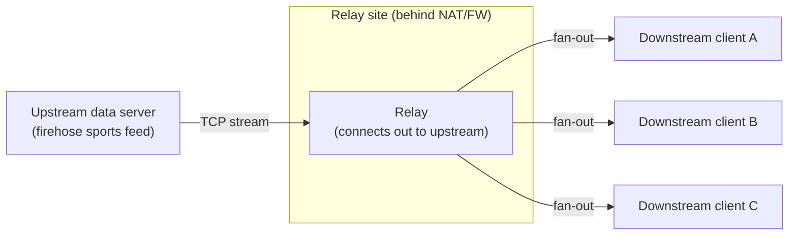
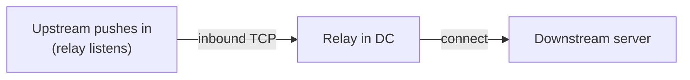
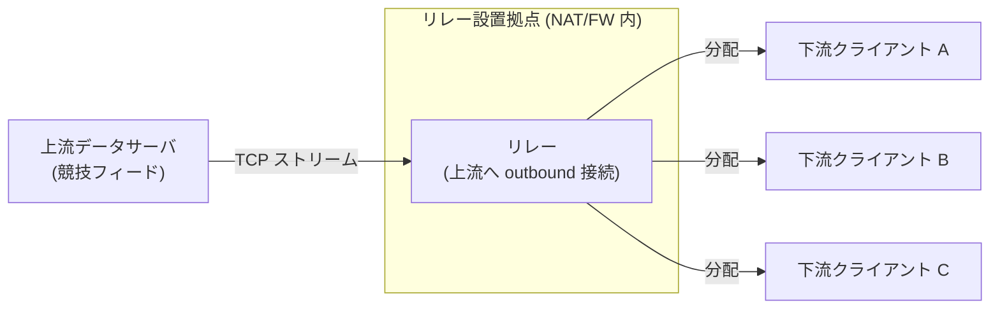

# TCP Relay Server

## English

### Overview
TCP Relay Server forwards upstream traffic to a downstream destination in a single direction. It offers four connection modes, automatic reconnection, optional data dumping, and a GUI for operating multiple relays in parallel.

**Note:** Only one-way flows (upstream -> downstream) are supported. Bidirectional relaying is not implemented; for firehose-style feeds (sports competition data, telemetry, live stats), one-way delivery is typically sufficient because clients only need to receive.

### Intended Use Case
- One-way continuous stream, e.g., sports competition data feeds or telemetry that must be fanned out to multiple receivers on-site or remote.
- Works when NAT / firewall (FW) / asymmetric reachability (only one side can reach; even ping fails from the other side) block inbound paths.
- By choosing connect/listen roles correctly, the relay can sit behind NAT while still reaching upstream and serving downstream clients.

### Mermaid: NAT Traversal Example


### Mermaid: Upstream-Listen / Downstream-Connect Example


### How to Choose a Mode (2 Questions)
1) Who can initiate TCP toward the upstream side? (relay -> upstream, or upstream -> relay)
2) Who initiates on the downstream side? (clients connect in, or relay connects out)

Mode cheat sheet:
- `connect-listen`: Relay connects to upstream; downstream clients connect to relay. Default for “relay behind NAT, multiple consumers”.
- `listen-connect`: Upstream connects into relay; relay connects out to a single downstream.
- `connect-connect`: Relay dials one upstream and one downstream (both ends only allow outbound).
- `listen-listen`: Relay listens on both sides (use when both ends can reach the relay directly).

Examples:
- Relay inside NAT, can dial upstream, downstream clients will connect → choose `connect-listen`.
- Upstream must push in, downstream must be dialed by relay → choose `listen-connect` (or `listen-listen` if downstream also connects in).

### Features
- Four relay modes: `connect-listen`, `listen-connect`, `connect-connect`, `listen-listen`
- Automatic reconnection when a link drops (`--retry` seconds, default 5)
- Multiple downstream clients in `connect-listen` and `listen-listen` modes
- Optional payload dump to stdout/log area (`--dump` or GUI checkbox)
- GUI with multi-tab management and auto-saved settings

### Requirements
- Python 3.x
- tkinter (bundled with standard Python; already included in the packaged GUI binary)

### Installation
1. Clone the repository:
   ```sh
   git clone https://github.com/tanaka-ryuya/TCPRelayServer.git
   cd TCPRelayServer
   ```
2. (Optional) Create a virtual environment:
   ```sh
   python -m venv .venv
   .\\.venv\\Scripts\\activate
   ```
3. No extra pip packages are required for the CLI or GUI.

### CLI Usage
Run `tcp_relay_server.py` (or `dist\\tcp_relay_server.exe`) with the required endpoints:
```sh
python tcp_relay_server.py <src_host>:<src_port> <dst_host>:<dst_port> --mode <mode> [--dump] [--retry <seconds>]
```

Arguments:
- `<src_host>:<src_port>`: Upstream source to read from
- `<dst_host>:<dst_port>`: Downstream destination to write to
- `--mode`: One of `connect-listen`, `listen-connect`, `connect-connect`, `listen-listen` (default: `connect-listen`)
- `--dump`: Print relayed data
- `--retry <seconds>`: Reconnect interval (default: 5)

### GUI Usage
- From source: `python relay_gui.py`
- Packaged binary: `dist\\relay_gui.exe`

Operation per tab:
1. Set upstream host/port and downstream host/port.
2. Choose mode and (optional) enable "dump to log".
3. Set reconnect interval seconds.
4. Click `Start` to run / `Stop` to halt the relay for that tab.
5. Use the `+` button to add another tab (defaults chain from the previous tab). Right-click a tab header or use the `タブを閉じる` button to remove it.

Configuration is automatically saved to `relay_gui_config.json` on exit and loaded on the next start. Logs and connection status are shown in each tab.

### Limitations
- One-way only (upstream -> downstream); not a bidirectional TCP proxy.
- No protocol parsing or application-layer awareness; payload is relayed as-is.
- Not suited for interactive bidirectional apps (SSH, databases, chat, etc.).

### License
MIT License

### Author
[TANAKA RYUYA](https://github.com/tanaka-ryuya/TCPRelayServer)

---

## 日本語

### 概要
TCP Relay Server は、上流から下流への一方向通信を中継する Python 製ツールです。4 種類の接続モード、切断時の自動再接続、データダンプ、複数タブを扱える GUI を備えています。

**注意:** 上流 -> 下流 の一方向のみ対応です。双方向リレーは非対応です。スポーツ配信やテレメトリなど「垂れ流し型」では受信専用が多く、一方向で十分なケースが一般的です。

### 想定ユースケース（重要）
- スポーツ競技データやテレメトリなど、一方向の連続ストリームを複数へ分配する現場。
- NAT / FW（ファイアウォール）/ 非対称到達性（asymmetric reachability: 片側からは届くが逆は届かない、ping も通らない場合あり）でも動かしたい。
- connect/listen の役割を正しく選べば、リレーを NAT 内側に置いたまま上流へ接続しつつ、下流クライアントにもサービスできる。

### Mermaid: NAT 越え構成例


### Mermaid: 上流待受 / 下流へ接続する例


### モード選択の考え方（2 問で決める）
1) 上流側へ TCP を張れるのはどちら？（リレーから発信か、上流から着信か）
2) 下流側は接続してくる？ それともリレーから繋ぎに行く？

モード簡易表:
- `connect-listen`: リレーが上流へ接続し、下流からの接続を待ち受け。NAT 内に置く場合の第一候補。
- `listen-connect`: 上流がリレーへ接続し、リレーが単一の下流へ接続。
- `connect-connect`: 両側ともリレーから発信（上流 1 / 下流 1 のみ、両端が外向きのみ許可のとき）。
- `listen-listen`: 両側ともリレーへ接続（両端がリレーへ到達できる場合）。

例:
- リレーが NAT 内、上流へは外向きで届き、下流クライアントはリレーへ接続してくる → `connect-listen`。
- 上流はリレーへ接続してくる必要があり、下流はリレーから接続したい → `listen-connect`（下流も着信なら `listen-listen` でも可）。

### 特長
- 接続モード: `connect-listen` / `listen-connect` / `connect-connect` / `listen-listen`
- 切断時の自動再接続（`--retry` 秒、デフォルト 5 秒）
- `connect-listen` と `listen-listen` では複数クライアントを受け付け
- 送信データのダンプ表示（`--dump` または GUI のチェック）
- GUI 版で複数タブ管理と設定の自動保存

### 必要要件
- Python 3.x
- tkinter（標準同梱。GUI の exe 版にも含まれます）

### セットアップ
1. リポジトリを取得:
   ```sh
   git clone https://github.com/tanaka-ryuya/TCPRelayServer.git
   cd TCPRelayServer
   ```
2. （任意）仮想環境を作成:
   ```sh
   python -m venv .venv
   .\\.venv\\Scripts\\activate
   ```
3. 追加ライブラリのインストールは不要です。

### CLI の使い方
`tcp_relay_server.py`（または `dist\\tcp_relay_server.exe`）を次のように実行します:
```sh
python tcp_relay_server.py <上流ホスト>:<上流ポート> <下流ホスト>:<下流ポート> --mode <モード> [--dump] [--retry 秒]
```

引数:
- `<上流ホスト>:<上流ポート>`: データを受け取る上流側
- `<下流ホスト>:<下流ポート>`: データを届ける下流側
- `--mode`: `connect-listen` / `listen-connect` / `connect-connect` / `listen-listen`（デフォルト: `connect-listen`）
- `--dump`: 送信データを標準出力に表示
- `--retry 秒`: 再接続までの待ち時間（デフォルト 5 秒）

### GUI の使い方
- ソースから起動: `python relay_gui.py`
- 同梱バイナリ: `dist\\relay_gui.exe`

各タブの操作手順:
1. 上流/下流のホスト・ポートを設定。
2. モードを選択し、必要なら「dump to log」をオン。
3. 再接続間隔（秒）を入力。
4. `Start` で中継開始、`Stop` で停止。
5. `+` ボタンでタブを追加（直前タブの設定を元に自動補完）。タブヘッダーを右クリック、または「タブを閉じる」ボタンでタブを削除。

設定は終了時に `relay_gui_config.json` に自動保存され、次回起動時に読み込まれます。ログと接続状態はタブ内で確認できます。

### 制限事項
- 一方向のみ（上流 -> 下流）。双方向 TCP プロキシ用途には非対応。
- プロトコル解析なし。ペイロードはそのまま中継。
- SSH や DB など双方向インタラクティブ用途には適しません。

### ライセンス
MIT License

### 作者
[TANAKA RYUYA](https://github.com/tanaka-ryuya/TCPRelayServer)
